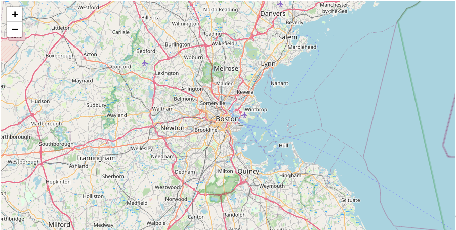

# Boston Crime Map: Insights and Analysis

This code is an example of using the Folium library in Python to create interactive maps visualizing crime data in Boston. Here's a breakdown of what each part does:

1. **Setting up the Environment**: Import necessary libraries such as Pandas for data manipulation, Geopandas for handling geographical data, and Folium for creating interactive maps.

2. **Creating the Basemap**: Initialize a Folium map (`m_1`) with a specified location and zoom level. This map will serve as the base for visualizations.

3. **Loading and Preprocessing Data**: Load crime data from a CSV file, dropping rows with missing location information, and filtering for major crimes occurring in 2018.

4. **Exploring the Data**: Perform some data exploration, such as selecting daytime robberies from the crime dataset.

5. **Visualizing Data on the Map**: Create different visualizations on separate maps (`m_2`, `m_3`, `m_4`, `m_5`, `m_6`) using Folium. These visualizations include:
   - Markers for daytime robberies (`m_2` and `m_3`).
   - Bubble map with varying colors based on the hour of the crime (`m_4`).
   - Heatmap showing the density of crimes (`m_5`).
   - Choropleth map showing the number of crimes in each police district (`m_6`).

Each map is created with specific features and overlays to provide different perspectives on the crime data.
```py
import pandas as pd
import geopandas as gpd
import math

import folium
from folium import Choropleth, Circle, Marker
from folium.plugins import HeatMap, MarkerCluster
```
# Create a map
`m_1 = folium.Map(location=[42.32,-71.0589], tiles='openstreetmap', zoom_start=10)`

# Display the map


# Load the data
`crimes = pd.read_csv("archive/crimes-in-boston/crimes-in-boston/crime.csv", encoding='latin-1')`

# Drop rows with missing locations
`crimes.dropna(subset=['Lat', 'Long', 'DISTRICT'], inplace=True)`

# Focus on major crimes in 2018
```py
crimes = crimes[crimes.OFFENSE_CODE_GROUP.isin([
    'Larceny', 'Auto Theft', 'Robbery', 'Larceny From Motor Vehicle', 'Residential Burglary',
    'Simple Assault', 'Harassment', 'Ballistics', 'Aggravated Assault', 'Other Burglary', 
    'Arson', 'Commercial Burglary', 'HOME INVASION', 'Homicide', 'Criminal Harassment', 
    'Manslaughter'])]
crimes = crimes[crimes.YEAR>=2018]
```
# Print the first five rows of the table
`crimes.head()`


```py
daytime_robberies = crimes[((crimes.OFFENSE_CODE_GROUP == 'Robbery') & \
                            (crimes.HOUR.isin(range(9,18))))]

```
# Create a map
`m_2 = folium.Map(location=[42.32,-71.0589], tiles='cartodbpositron', zoom_start=13)`

# Add points to the map
```py
for idx, row in daytime_robberies.iterrows():
    Marker([row['Lat'], row['Long']]).add_to(m_2)
```
# Display the map


# Create the map
`m_3 = folium.Map(location=[42.32,-71.0589], tiles='cartodbpositron', zoom_start=13)`

# Add points to the map
```py
mc = MarkerCluster()
for idx, row in daytime_robberies.iterrows():
    if not math.isnan(row['Long']) and not math.isnan(row['Lat']):
        mc.add_child(Marker([row['Lat'], row['Long']]))
m_3.add_child(mc)
```

# Display the map


# Create a base map
```py
m_4 = folium.Map(location=[42.32,-71.0589], tiles='cartodbpositron', zoom_start=13)

def color_producer(val):
    if val <= 12:
        return 'forestgreen'
    else:
        return 'darkred'
```

# Add a bubble map to the base map
```py
for i in range(0,len(daytime_robberies)):
    Circle(
        location=[daytime_robberies.iloc[i]['Lat'], daytime_robberies.iloc[i]['Long']],
        radius=20,
        color=color_producer(daytime_robberies.iloc[i]['HOUR'])).add_to(m_4)
```
# Display the map


# Create a base map
`m_5 = folium.Map(location=[42.32,-71.0589], tiles='cartodbpositron', zoom_start=12)`

# Add a heatmap to the base map
`HeatMap(data=crimes[['Lat', 'Long']], radius=10).add_to(m_5)`

# Display the map


# GeoDataFrame with geographical boundaries of Boston police districts
```py
districts_full = gpd.read_file('archive/Police_Districts/Police_Districts/Police_Districts.shp')
districts = districts_full[["DISTRICT", "geometry"]].set_index("DISTRICT")
districts.head()
```

# Number of crimes in each police district
```py
plot_dict = crimes.DISTRICT.value_counts()
plot_dict.head()
```

# Create a base map
`m_6 = folium.Map(location=[42.32,-71.0589], tiles='cartodbpositron', zoom_start=12)`

# Add a choropleth map to the base map
```py
Choropleth(geo_data=districts.__geo_interface__, 
           data=plot_dict, 
           key_on="feature.id", 
           fill_color='YlGnBu', 
           legend_name='Major criminal incidents (Jan-Aug 2018)'
          ).add_to(m_6)
```
# Display the map


